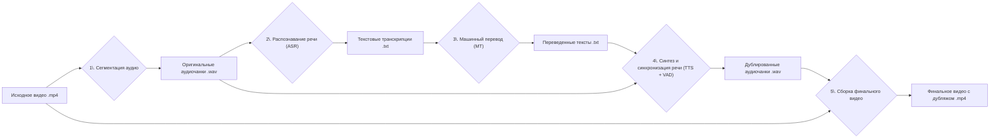

# Каскадный пайплайн для дубляжа видео с клонированием голоса

Этот проект представляет собой полный каскадный пайплайн для автоматического дубляжа видео с английского на русский язык. Ключевой особенностью является использование state-of-the-art модели `XTTSv2` для генерации русской речи с сохранением уникальных характеристик голоса оригинального спикера (Zero-Shot Voice Cloning).

## 🚀 Демонстрация

Полная работа пайплайна, включая исследование промежуточных артефактов, доступна в интерактивном режиме в веб-приложении:

**[➡️ Открыть Live Демо](https://turgunbek-project-videodubbing.streamlit.app/)**

Краткая видео-демонстрация работы приложения доступна в файле [`Demo_1.wmv`](https://github.com/turgunbek/project_video_dubbing/raw/main/Demo_1.wmv) (длительность 2 минуты):

## ⚙️ Архитектура пайплайна

Пайплайн состоит из нескольких последовательных этапов, каждый из которых выполняет свою задачу и передает результат следующему.

Ключевой особенностью является **Шаг 4**, где для каждого чанка определяется наличие и начало речи. Если в чанке есть музыка/тишина до начала речи, она сохраняется из оригинала, а сгенерированная русская речь "приклеивается" в нужный момент, обеспечивая идеальную синхронизацию.

## 🛠️ Стек технологий и выбор моделей

*   **Сегментация аудио:** `pydub` - для базовой нарезки аудио на чанки по тишине, `silero-vad` - для определения речи в аудио от не речи (музыка, тишина и прочее).
*   **Распознавание речи (ASR):** `OpenAI Whisper (base model)` - выбрана как де-факто индустриальный стандарт, обеспечивающий высокую точность транскрибации для английского языка даже при наличии фонового шума.
*   **Машинный перевод (MT):** `Helsinki-NLP/opus-mt-en-ru` - легковесная и эффективная модель из экосистемы Hugging Face, оптимизированная для перевода с английского на русский. Демонстрирует хороший баланс между качеством и скоростью работы.
*   **Синтез речи (TTS) и клонирование голоса:** `Coqui XTTSv2` - state-of-the-art модель для многоязычного синтеза речи и клонирования голоса в режиме zero-shot. Она способна генерировать высококачественную речь на целевом языке (русский), используя лишь короткий аудио-фрагмент на исходном языке (английский) в качестве образца голоса.
*   **Детектор активности голоса (VAD):** `silero-vad` - используется на этапе синтеза для точного определения начала речи в оригинальных чанках, что критически важно для синхронизации дубляжа с фоновой музыкой.
*   **Сборка видео:** `moviepy` - мощная библиотека для видео-обработки в Python.
*   **Веб-демо:** `Streamlit` - фреймворк для быстрого создания интерактивных веб-приложений для data science и ML проектов.

## 📁 Структура проекта

Репозиторий организован для демонстрации через Streamlit и содержит только необходимые для запуска артефакты.

-   `app.py`: Главный скрипт Streamlit-приложения.
-   `requirements.txt`: Список Python-зависимостей для установки.
-   `packages.txt`: Список системных зависимостей (`ffmpeg`).
-   `final_video/`: Готовые дублированные видеофайлы.
-   `pipeline_artifacts/`: Все промежуточные результаты пайплайна (чанки, тексты, дубляжи), сгруппированные по спикерам.
-   `live_demo_samples/`: Короткие аудио-фрагменты для вкладки "Live Демо".
-   `src/`: Исходные Python-скрипты, использованные для генерации артефактов.
-   `*.mp4`: Оригинальные видеофайлы.

## ⚙️ Ход работ (Генерация артефактов)

Все результаты и артефакты, представленные в веб-демо, были сгенерированы путем последовательного запуска скриптов из папки `src/`. Ниже описан пошаговый процесс.

1.  **Подготовка данных:**
    *   Исходные видео `Bill_Gates.mp4` и `Cameron_Russell.mp4` были помещены в корневую директорию проекта.
    *   Были извлечены аудиодорожки и сохранены в формате `.wav` в директорию `raw_audio`

2.  **Сегментация аудио:**
    *   **Скрипт:** `src/robust_splitter.py`
    *   **Вход:** Исходные `raw_audio/[SPEAKER_NAME].wav` файлы.
    *   **Выход:** Папка `pipeline_artifacts/[SPEAKER_NAME]/splited_audio_robust/`, содержащая аудиочанки в формате `.wav` и файл с таймингами `timings.json`. На этом этапе был применен "хардкод" для корректной обработки музыкального вступления в видео Камерон Рассел.

3.  **Распознавание речи (ASR):**
    *   **Скрипт:** `src/transcribe_chunks.py`
    *   **Вход:** Папка с аудиочанками (`splited_audio_robust`).
    *   **Выход:** Папка `pipeline_artifacts/[SPEAKER_NAME]/transcriptions/` с текстовыми файлами транскрибаций для каждого чанка.

4.  **Машинный перевод (MT):**
    *   **Скрипт:** `src/translate_en_ru.py`
    *   **Вход:** Папка с транскрипциями (`transcriptions`).
    *   **Выход:** Папка `pipeline_artifacts/[SPEAKER_NAME]/translations/` с переведенными на русский язык текстами.

5.  **Синтез и синхронизация речи (TTS):**
    *   **Скрипт:** `src/tts_generate_dub.py`
    *   **Вход:** Оригинальные аудиочанки (для анализа и сохранения фоновых звуков) и папка с переводами.
    *   **Выход:** Папка `pipeline_artifacts/[SPEAKER_NAME]/dubbed_audio/` с **уже синхронизированными** аудиофайлами на русском языке. На этом ключевом этапе VAD определяет начало речи в оригинале, и сгенерированная русская речь "склеивается" с исходной музыкой/тишиной.

6.  **Финальная сборка видео:**
    *   **Скрипт:** `src/assemble_video.py`
    *   **Вход:** Оригинальное видео, папка с синхронизированными дублированными чанками (`dubbed_audio`) и файл таймингов.
    *   **Выход:** Готовые видео с дубляжом в папке `final_video/`.

Этот пошаговый процесс позволил получить все необходимые артефакты для последующей демонстрации в интерактивном приложении Streamlit.

## 🔬 Анализ архитектуры XTTSv2

Модель `XTTSv2` (на основе [этой работы](https://arxiv.org/pdf/2406.04904)) является сложной системой, состоящей из нескольких ключевых компонентов:
1.  **Text Encoder:** Преобразует входной текст (на русском) в последовательность числовых векторов (эмбеддингов), которые кодируют фонетическую и семантическую информацию.
2.  **Speaker Encoder:** Принимает на вход короткий аудио-фрагмент (3-10 секунд) с голосом оригинального спикера и извлекает из него вектор, который представляет уникальные характеристики этого голоса (тембр, интонации).
3.  **Latent Diffusion Model:** Это "сердце" модели. Он берет эмбеддинги текста и эмбеддинг голоса, объединяет их и итеративно генерирует "скрытое" (латентное) представление будущей аудиодорожки. Этот процесс позволяет модели научиться совмещать содержание текста с характеристиками голоса.
4.  **Decoder (Vocoder):** Преобразует латентное представление, сгенерированное диффузионной моделью, в реальную звуковую волну (waveform), которую мы можем услышать.

Благодаря такой архитектуре, модель может генерировать речь на любом из поддерживаемых языков, используя характеристики голоса, "увиденные" в аудио на совершенно другом языке.

## 🚧 Проблемы текущего пайплайна и возможные улучшения

1.  **Надежность сегментации:**
    *   **Проблема:** Изначальный сплиттер на базе `pydub` не отличает музыку от речи, что приводит к неверной нарезке чанков для видео с музыкальным вступлением (как у Камерон Рассел). Это потребовало ручного вмешательства ("хардкода").
    *   **Улучшение:** Использовать архитектурно верный подход: сначала применить `silero-vad` ко всему аудиофайлу для получения точных временных меток *только речи*, и только затем нарезать аудио на чанки по этим меткам. Это полностью автоматизирует процесс и сделает его нечувствительным к фоновой музыке.

    ### Эволюция решения и описание скриптов в `src`
    
    В процессе работы над проблемой сегментации было предпринято несколько итеративных подходов, прежде чем была выработана текущая рабочая версия. Исходные коды этих этапов сохранены в папке `src/` в качестве архива процесса разработки.
    
    1.  **Первоначальная гипотеза:** Создавать "гибридные" аудиочанки на лету на финальном этапе сборки видео (`assemble_video.py`). Для этого на каждом чанке запускался `silero-vad`, чтобы найти начало речи.
        *   **Результат:** Подход оказался нестабильным. VAD давал ошибочные результаты для чанков, где музыка была слишком "насыщенной", принимая ее за речь. Это приводило к рассинхронизации.
    
    2.  **Вторая гипотеза:** Перенести логику определения начала речи на самый первый этап — в сплиттер (`robust_splitter.py`). Идея заключалась в том, чтобы один раз проанализировать чанк и сохранить точное время начала речи в `timings.json`.
        *   **Результат:** Этот подход также не увенчался успехом, так как исходный сплиттер на `pydub` уже создавал "грязные" чанки, а логика расчета времени оказалась неверной.
    
    3.  **Текущее рабочее решение (прагматичный подход):**
        *   **Проблема была решена "в лоб"** путем ручной корректировки ("хардкода") сегментации для проблемного видео Камерон Рассел.
        *   **Ключевое архитектурное изменение:** Вся логика по созданию "гибридного" аудио была перенесена из сборщика видео в скрипт генерации TTS (`tts_generate_dub.py`). Теперь этот скрипт отвечает за синхронизацию, принимая на вход оригинальный чанк и текст перевода, и выдавая на выходе **готовый к использованию, уже синхронизированный** дублированный аудиофайл.
        *   **Результат:** Это значительно упростило финальный скрипт сборки (`assemble_video.py`), сделав его надежным и предсказуемым.
    
    Таким образом, папка `src/` содержит полный набор скриптов, реализующих финальную, рабочую версию пайплайна.

3.  **Производительность TTS:**
    *   **Проблема:** Генерация озвучки для одного видео занимает более 40 минут на CPU, что неприемлемо для интерактивных систем.
    *   **Улучшение:**
        *   **Использование GPU:** Перенос вычислений на GPU ускорит процесс в 5-10 раз.
        *   **Батчинг:** Подача на генерацию сразу нескольких текстов (батчем) вместо одного за раз для более эффективного использования ресурсов.

4.  **Последовательное выполнение:**
    *   **Проблема:** Пайплайн строго последователен — следующий шаг не начнется, пока предыдущий не завершится для *всех* чанков.
    *   **Улучшение:** Внедрить **асинхронную обработку**. Как только для `чанка №1` готова транскрипция, его можно сразу отправлять на перевод и далее на TTS, не дожидаясь обработки `чанка №2`. Это можно реализовать с помощью `asyncio` или `multiprocessing`.
  
5.  **Модель Machine Translation (MT):**
    *   **Модель 1:** Сначала выбрал модель ["facebook/wmt19-en-ru"](https://huggingface.co/facebook/wmt19-en-ru), руководствуясь тем, что модель двуязычная и имеет некую популярность. Однако эта модель дала довольно много откровенных галлюцинаций. Поэтому выбрал другую модель.
    *   **Модель 2:** Модель ["Helsinki-NLP/opus-mt-en-ru"](https://huggingface.co/Helsinki-NLP/opus-mt-en-ru) более нова и более стабильна. Даёт приемлемое качество. Не лишена недостатков, однако довольно легковесная и быстрая.

## 🔜 Будущая работа

### Few-Shot Voice Cloning (В разработке)
-   [ ] Выбрать голос персонажа, который плохо копируется в режиме zero-shot.
-   [ ] Собрать небольшой датасет (1-5 минут) аудиозаписей этого голоса.
-   [ ] Выполнить файнтюнинг модели `XTTSv2` на этих данных.
-   [ ] Сравнить качество генерации (до и после файнтюнинга) и посчитать объективную метрику схожести голоса (например, косинусное расстояние между эмбеддингами).
